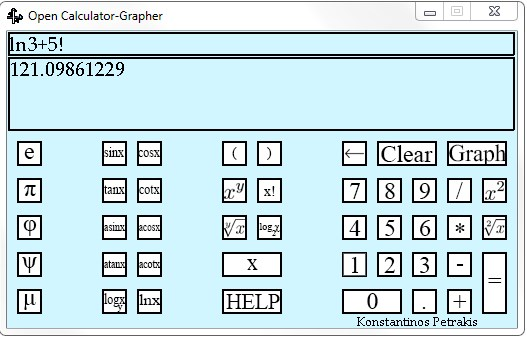
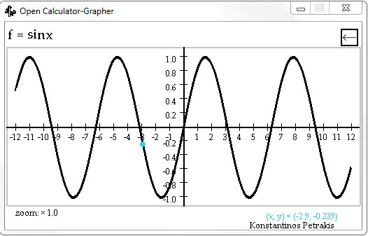

# OpenCalculator

## Description
OpenCalculator is an open source calculator and plotter, created by me using Python, Pygame, re and math.

## Installation
1. Download the whole "images" folder and "help.txt" and place it in a directory.
2. Download calculator.py and place it in the same directory and just run it, if you're using windows os, an executable version is avaiable. 
**Keep in mind the library dependencies**
If you go with calculator.py option, pygame and re have to be installed to your computer. Both of them are cross-platform. 

## Usage
OpenCalculator is small project which allows you to do mathematical calculations and plot a function in the x-y plane.  
Screenshots 
 

 

##Known bugs
